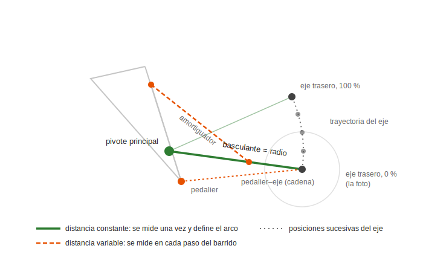
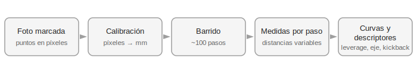

# Fundamentos del motor de cinemática

Este documento explica **cómo BikeMatch obtiene las curvas de comportamiento de una
suspensión a partir de una única fotografía**, y por qué el método es matemáticamente
sólido. Está dirigido a lectores sin conocimientos de bicicletas (evaluadores,
desarrolladores). La interpretación de los resultados (qué significa cada número) se
documenta aparte, en `base-conocimiento-cinematica.md`. Cada sección está pensada
para poder usarse como material de presentación.

---

## 1. El problema

Dada una fotografía lateral de una bicicleta de doble suspensión y unos pocos datos de
su ficha técnica, calcular las curvas que describen el comportamiento de su suspensión
trasera: relación de palanca (*leverage ratio*), trayectoria del eje trasero y retroceso
de pedal (*pedal kickback*).

No hay sensores ni medición física: **todo se deriva por geometría** a partir de puntos
que el usuario marca sobre la foto. El motor es código Java puro (sin framework),
determinista y verificable con tests.

## 2. La entrada del motor

Dos tipos de datos:

**Puntos marcados sobre la foto.** El usuario marca la posición de los elementos
mecánicos relevantes. Cada punto viaja con una **etiqueta** que identifica su papel
(el cálculo necesita saber *qué* es cada coordenada):

| Punto | Papel en el cálculo |
|---|---|
| Eje delantero y eje trasero | Calibración de escala (y el trasero, además, es el punto cuya trayectoria se calcula) |
| Pivote principal | Centro de giro del brazo trasero (basculante) |
| Anclajes del amortiguador (2) | Sus extremos; la variación de su distancia mide la compresión |
| Eje de pedalier | Referencia para el crecimiento de cadena (kickback) |

Los puntos se almacenan **normalizados (0–1)** respecto a las dimensiones de la imagen,
para ser independientes del dispositivo y del tamaño de pantalla.

**Parámetros de ficha técnica:** carrera del amortiguador, recorrido trasero declarado,
desarrollo de cálculo (dientes de plato y piñón, derivados del tipo de cassette) y
porcentaje de *sag* (punto de trabajo estático; 30 % por defecto).

## 3. Calibración: de píxeles a milímetros

La foto expresa posiciones en píxeles, y cada foto tiene una escala distinta. Para
convertir a milímetros se usa una **distancia real conocida entre dos puntos marcados**:
la distancia entre ejes (*wheelbase*), publicada por el fabricante en la tabla de
geometría.

```
factor de escala (mm/px) = distancia entre ejes real (mm) / distancia entre ejes medida (px)
```

Se eligió la distancia entre ejes por ser la mayor distancia marcable: **cuanto más larga
es la referencia, menor es el impacto relativo del error de marcado manual**. La medida
entre anclajes del amortiguador (*eye-to-eye*, también conocida de ficha) queda como
verificación cruzada.

## 4. El principio geométrico: sólidos rígidos

Las piezas de una suspensión son sólidos rígidos: **la distancia entre dos puntos de una
misma pieza no cambia nunca**, por definición. En un monopivote, el eje trasero pertenece
al basculante, que solo puede girar alrededor del pivote principal. En consecuencia, el
eje trasero únicamente puede moverse a lo largo de **un arco de circunferencia** centrado
en el pivote, de radio igual a la distancia pivote–eje.

Esa distancia se mide **una sola vez** sobre la foto calibrada, y determina por completo
el movimiento posible. Esta es la razón por la que una única fotografía es suficiente:
las distancias constantes fijan la trayectoria, sin necesidad de ver la suspensión en
movimiento.



## 5. Simulación del recorrido (barrido)

La foto captura un solo instante (suspensión extendida). El movimiento se reconstruye
numéricamente: el motor **rota el basculante alrededor del pivote en ~100 incrementos**
y, en cada incremento, recalcula la posición de todos los puntos móviles. Es el
equivalente numérico de comprimir la suspensión paso a paso en un soporte de taller,
registrando posiciones en cada paso.

En cada paso se miden las **distancias variables**:

- **Longitud actual del amortiguador** (distancia entre sus anclajes) → carrera consumida.
- **Distancia pedalier–eje trasero** → crecimiento de cadena.
- **Posición del eje** → un punto más de su trayectoria.

El barrido termina cuando la carrera consumida iguala la carrera nominal del
amortiguador: la suspensión ha llegado a su tope.



## 6. De las medidas a las curvas

- **Leverage ratio:** en cada paso, mm que sube la rueda por cada mm de carrera del
  amortiguador (Δ recorrido vertical / Δ carrera). Es la curva principal.
- **Trayectoria del eje:** la lista de posiciones del eje; se resume en el retroceso
  máximo (mm) y el tramo donde ocurre.
- **Recorrido total calculado:** desplazamiento vertical del eje entre el inicio y el
  final del barrido.
- **Pedal kickback:** derivado del crecimiento de la distancia pedalier–eje y del
  desarrollo usado (plato × piñón). Se informa siempre con sus condiciones de cálculo.
- **Descriptores:** la curva de leverage se analiza **partida en el punto de sag** (30 %
  por defecto) para extraer métricas como la progresión útil. Los criterios de
  interpretación viven en `base-conocimiento-cinematica.md`.

## 7. Verificación

Tres niveles:

1. **Tests unitarios geométricos:** casos con solución conocida a mano.
2. **Validación contra software de referencia:** las curvas de bicicletas reales se
   comparan con las del programa *Linkage* (estándar del sector) con tolerancia ±3 %.
3. **Control de coherencia en producción:** si el recorrido calculado difiere más de un
   ±10 % del declarado por el fabricante, el resultado se marca con una alerta (puntos
   probablemente mal marcados o calibración incorrecta) que acompaña a todo el análisis.

## 8. Alcance de la v1 y límites conocidos

- **v1:** sistema monopivote (el más simple, valida el método de punta a punta).
  Después, sistemas de 4 barras (Horst link y variantes), que junto al monopivote cubren
  la mayoría del mercado.
- **Fuera de v1, documentado como trabajo futuro:** anti-squat y anti-rise (requieren
  asumir la altura del centro de gravedad del conjunto bici+ciclista, dato que no está
  en la foto) y el simulador de emparejamiento de amortiguadores (requiere modelar
  curvas de resorte genéricas).
- El motor vive como **dominio puro** (paquete `kinematics`, sin dependencias de
  Spring ni de base de datos): entradas numéricas → salidas numéricas, 100 % testeable
  de forma aislada.
