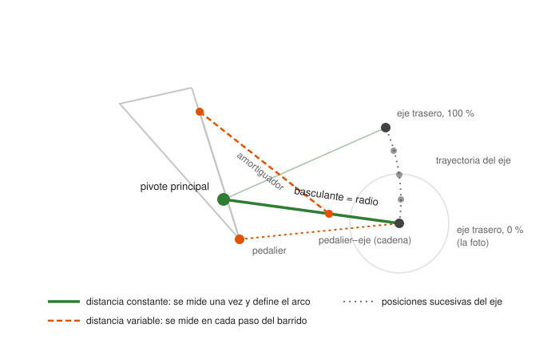
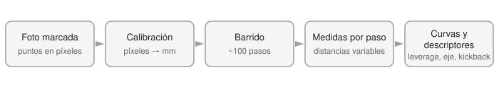

# Fundamentos del motor de cinemática

Este documento explica **cómo BikeMatch obtiene las curvas de comportamiento de una
suspensión a partir de una única fotografía**, y por qué el método es matemáticamente
sólido. Está dirigido a lectores sin conocimientos de bicicletas (evaluadores,
desarrolladores). La interpretación de los resultados (qué significa cada número) se
documenta aparte, en `base-conocimiento-cinematica.md`. Cada sección está pensada
para poder usarse como material de presentación.

---

## 1. El problema

Dada una fotografía lateral de una bicicleta de doble suspensión y unos pocos datos de
su ficha técnica, calcular las curvas que describen el comportamiento de su suspensión
trasera: relación de palanca (*leverage ratio*), trayectoria del eje trasero, retroceso
de pedal (*pedal kickback*), anti-squat (respuesta al pedalear) y anti-rise (respuesta
al frenar).

No hay sensores ni medición física: **todo se deriva por geometría** a partir de puntos
que el usuario marca sobre la foto. El motor es código Java puro (sin framework),
determinista y verificable con tests.

## 2. La entrada del motor

Dos tipos de datos:

**Puntos marcados sobre la foto.** El usuario marca la posición de los elementos
mecánicos relevantes. Cada punto viaja con una **etiqueta** que identifica su papel
(el cálculo necesita saber *qué* es cada coordenada). Todos los sistemas comparten estos:

| Punto | Papel en el cálculo |
|---|---|
| Eje delantero y eje trasero | Orientación de la foto y distancia entre ejes (el trasero, además, es el punto cuya trayectoria se calcula) |
| Pivote principal | Centro de giro de la pieza que lleva la rueda (o de la vaina, en las cuatro barras) |
| Anclaje del amortiguador al cuadro | Extremo fijo del amortiguador |
| Eje de pedalier | Referencia para la cadena (kickback y anti-squat) |

Cada sistema añade los suyos: el monopivote, el anclaje del amortiguador al basculante
(6 puntos en total); las cuatro barras, el pivote Horst, los dos pivotes de la bieleta
y el ojo móvil del amortiguador (9 puntos, o 10 con extensión del amortiguador). El
detalle está en [`modelos-cuatro-barras.md`](modelos-cuatro-barras.md).

Los puntos se almacenan en **píxeles de la imagen original**, acompañados por su ancho,
alto y la versión del formato. No son los píxeles con los que la foto aparece en pantalla:
el `viewBox` del marcador SVG conserva la correspondencia al verla grande, pequeña o en
otro dispositivo.

Mientras el análisis solo sea una previsualización, se pueden corregir la foto y los
puntos. Al guardar el primer resultado de una bicicleta, ambos pasan a ser su fuente
inmutable. Para usar otra foto o volver a marcar se crea otro análisis, aunque represente
la misma bicicleta.

**Parámetros de ficha técnica:** medidas del amortiguador (ojo a ojo y carrera), recorrido
trasero declarado, configuración de ruedas y tipo de bici. El tipo fija el desarrollo de
referencia (plato y piñón) y el *sag* se fija en el 30 % para todas las bicis, para que
las cifras «en el sag» se puedan comparar entre ellas.

## 3. Calibración: de píxeles a milímetros

La foto expresa posiciones en píxeles, y cada foto tiene una escala distinta. Para
convertir a milímetros se usa una **distancia real conocida entre dos puntos marcados**:
la medida **ojo a ojo del amortiguador** (distancia entre sus dos anclajes, publicada en
su ficha):

```
factor de escala (mm/px) = ojo a ojo real (mm) / distancia entre anclajes medida (px)
```

Se usa el ojo a ojo porque sus dos anclajes ya se marcan para el cálculo (sin puntos
extra) y es un dato igual para todas las tallas (el amortiguador es compartido).

**Qué afecta la escala:** a todas las cifras absolutas (recorrido, kickback, retroceso del
eje) y también al **valor** del LR, porque la carrera del amortiguador se introduce aparte
en milímetros y no sale de la foto. En cambio, la **progresión** y la **forma** de la curva
son cocientes entre dos LR: la escala se cancela y no les afecta.

**Precisión y mejora futura:** cuanto más larga es la referencia, menor es el error de
marcado sobre la escala. Referencias más largas y fáciles de encontrar en la ficha —la
**distancia entre ejes** o la **longitud de vainas**— darían una escala más precisa;
ofrecer varias opciones de calibración es una mejora prevista (ver
`limitaciones-y-mejoras.md`).

## 4. El principio geométrico: sólidos rígidos

Las piezas de una suspensión son sólidos rígidos: **la distancia entre dos puntos de una
misma pieza no cambia nunca**, por definición.

**Monopivote.** El eje trasero pertenece al basculante, que solo puede girar alrededor del
pivote principal. En consecuencia, el eje trasero únicamente puede moverse a lo largo de
**un arco de circunferencia** centrado en el pivote, de radio igual a la distancia
pivote–eje. Esa distancia se mide **una sola vez** sobre la foto calibrada, y determina por
completo el movimiento posible. Esta es la razón por la que una única fotografía es
suficiente: las distancias constantes fijan la trayectoria, sin necesidad de ver la
suspensión en movimiento.



**Cuatro barras.** El mismo principio, con cuatro piezas unidas en cadena: el cuadro, la
vaina (del pivote principal al pivote Horst), la bieleta (gira en el cuadro) y el tirante,
que une la vaina con la bieleta y **lleva el eje trasero**. Si se conoce la posición de una
pieza, las demás quedan fijadas: un punto que está a distancia fija de otros dos se
encuentra en el **cruce de dos circunferencias**. Es un cálculo cerrado, sin aproximaciones
numéricas, y cada paso elige el cruce más cercano al paso anterior para que el mecanismo no
«salte» a otra forma de montarse.

## 5. Simulación del recorrido (barrido)

La foto captura un solo instante (suspensión extendida). El movimiento se reconstruye
numéricamente: el motor divide la **carrera del amortiguador en 100 pasos iguales** y, en
cada uno, calcula dónde tiene que estar cada pieza para que el amortiguador mida
exactamente esa longitud. Es el equivalente numérico de comprimir la suspensión paso a
paso en un soporte de taller, registrando posiciones en cada paso.

- En el **monopivote**, el giro del basculante sale directamente de la ley del coseno
  (triángulo pivote–anclaje fijo–anclaje móvil).
- En las **cuatro barras**, el amortiguador empuja la bieleta (o una extensión unida a ella),
  y la bieleta arrastra al resto con cruces de circunferencias.
- Cuando el amortiguador lo empujan los **tirantes**, su longitud depende de todo el
  mecanismo a la vez. El motor usa entonces el giro de la bieleta como entrada y lo afina
  por **bisección** (acotar el giro entre dos valores y partir el intervalo por la mitad
  hasta clavar la longitud del amortiguador).

En cada paso se registran:

- **Posición del eje trasero** → un punto más de su trayectoria.
- **Posición de las piezas** → centro instantáneo de rotación de la pieza que lleva la
  rueda (anti-squat y anti-rise).
- **Posición del eje respecto al pedalier** → crecimiento y giro de la cadena (kickback).



## 6. De las medidas a las curvas

- **Relación de palanca:** en cada paso, mm que sube la rueda por cada mm de carrera del
  amortiguador (Δ recorrido vertical / Δ carrera). Es la curva principal.
- **Trayectoria del eje:** la lista de posiciones del eje; se resume en el retroceso
  máximo (mm) y el tramo donde ocurre.
- **Recorrido total calculado:** desplazamiento vertical del eje entre el inicio y el
  final del barrido.
- **Pedal kickback:** grados que giran las bielas hacia atrás. Suma el crecimiento del
  tramo de cadena, su enrollado en el piñón al girar y el giro de la rueda asociado al
  movimiento del eje, con el desarrollo de referencia del tipo de bici.
- **Anti-squat y anti-rise:** porcentajes calculados con unas ruedas y una altura del
  centro de gravedad de referencia, iguales para todas las bicis. Fórmulas y supuestos en
  [`modelo-referencia-cinematica.md`](modelo-referencia-cinematica.md).
- **Descriptores:** de la curva de palanca se extraen sus números (LR inicial, en sag,
  final y medio; progresión total y útil) y su **forma en tres fases** (tercio inicial,
  medio y final, cada una progresiva, lineal o regresiva; el tercio final es la zona de
  tope). Los criterios de interpretación viven en `base-conocimiento-cinematica.md`.

## 7. Verificación

Tres niveles:

1. **Tests unitarios geométricos:** casos con solución conocida a mano, conservación de
   las longitudes de cada pieza en todo el barrido y comparación entre modelos. Por ejemplo,
   si el ojo del amortiguador coincide con la unión del tirante y la bieleta, el modelo por
   tirantes y el de bieleta deben dar lo mismo paso a paso.
2. **Validación con bicis reales:** el monopivote se contrastó con dos bicis cuyas curvas
   están publicadas, con recorrido y extremos del LR dentro de un **±3 %** (#54). En las
   cuatro barras, el recorrido calculado de una e-bike de enduro con el amortiguador en los
   tirantes quedó a un 1,8 % del declarado, y la curva de palanca de otra bici coincidió
   con la publicada por su fabricante (de 2,97 a 2,20 frente a 2,95 a 2,15). La validación
   sistemática de las cuatro barras sigue abierta (#222, #237).
3. **Control de coherencia en producción:** si el recorrido calculado difiere más de un
   ±10 % del declarado por el fabricante, el resultado se marca con una alerta (puntos
   probablemente mal marcados o calibración incorrecta) que acompaña a todo el análisis.

## 8. Alcance y arquitectura

- **Sistemas soportados:** monopivote simple y tres variantes de cuatro barras (amortiguador
  en la bieleta, con extensión rígida del amortiguador y empujado por los tirantes).
- **Fuera de alcance:** monopivotes con bieleta que cambia el accionamiento del amortiguador,
  pivotes virtuales de dos bieletas cortas, pivote alto con polea y frenos flotantes. Cada uno
  necesita su propio modelo (ver `limitaciones-y-mejoras.md`).
- El motor vive como **dominio puro** (paquete `kinematics`, sin dependencias de Spring ni
  de base de datos): entradas numéricas → salidas numéricas, 100 % testeable de forma
  aislada. Su organización interna: `model` (entradas), `geometry` (puntos, circunferencias,
  cadena), `solver` (un solver por sistema), `curve` y `descriptor` (curvas y resúmenes) y
  `check` (comprobación del recorrido). El paquete `api` es la única puerta web.
